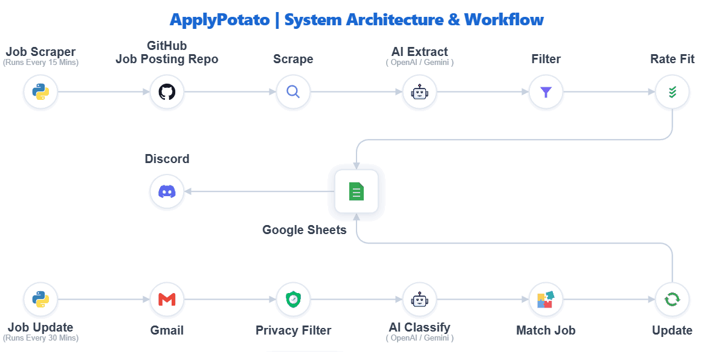
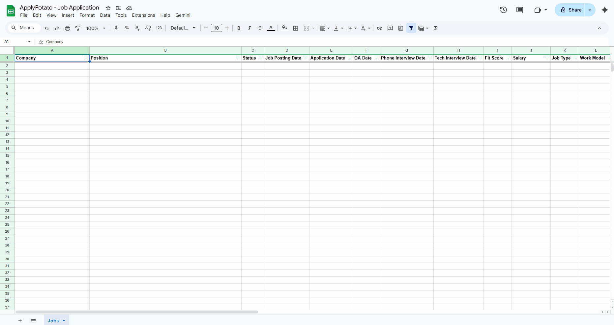
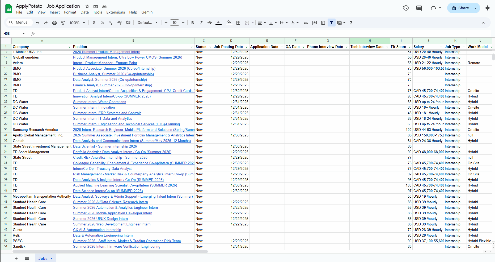

# ApplyPotato

A self-hosted, AI-powered job tracking system that automatically scrapes GitHub job lists, filters opportunities by your eligibility, monitors application status via Gmail, and syncs everything to Google Sheets.


## Features

- **GitHub Job Scraping** — Automatically monitors GitHub job list repositories (markdown tables with job links)
- **AI-Powered Extraction** — Uses GPT-4o-mini or Gemini to extract job requirements from any job page format
- **Smart Filtering** — Filters jobs by class standing, graduation date, work authorization, and season/year
- **Fit Scoring** — Scores jobs 0-100 based on skills, location, salary, and company preferences
- **Gmail Status Tracking** — Detects application confirmations, OAs, interviews, offers, and rejections
- **Google Sheets UI** — All data in a familiar spreadsheet interface with status colors
- **Discord Notifications** — Instant alerts when dream company jobs are found
- **Privacy First** — Runs entirely on your machine, no data sent to third parties

## How It Works

<p align="center">
  
</p>

**Two separate services, no conflicts:**
- Job Scraper Service: creates new job rows (`scrape_jobs.py`)
- Job Update Serice:   update existing rows with status changes (`check_gmail.py`)

## See It In Action

- Jobs are automatically scraped from GitHub lists, filtered by your eligibility, and added to Google Sheets with extracted details like salary, location, and fit scores.

<p align="center">
  
</p>

- Get instant Discord notifications on your phone when dream company jobs are added to your sheet.

<p align="center">
  
</p>

- As you apply and receive responses, the app parses your Gmail to detect confirmations, OA invites, interviews, and offers—updating your sheet automatically.

<p align="center">
  
</p>


## Prerequisites

- **Python 3.10+**
- **Git**
- **Google Cloud Project** with:
  - Google Sheets API enabled
  - Gmail API enabled
  - OAuth 2.0 credentials (Desktop app)
- **AI API Key** (one of):
  - OpenAI API key ([get one](https://platform.openai.com/api-keys))
  - Google Gemini API key ([get one](https://makersuite.google.com/app/apikey))

## Quick Start

### 1. Clone and Set Up Environment

```bash
git clone https://github.com/yourusername/apply-potato.git
cd apply-potato

# Create virtual environment
python -m venv venv

# Activate (Windows)
venv\Scripts\activate

# Activate (macOS/Linux)
source venv/bin/activate

# Install dependencies
pip install -r requirements.txt

# Install Playwright browser
playwright install chromium
```

### 2. Set Up Google Cloud

1. Go to [Google Cloud Console](https://console.cloud.google.com/)
2. Create a new project (or use existing)
3. Enable **Google Sheets API** and **Gmail API**
4. Go to **APIs & Services → Credentials**
5. Create **OAuth 2.0 Client ID** (Desktop app)
6. Download the JSON file
7. Save it as `auth/credentials.json`

### 3. Create Google Sheet

1. Create a new Google Sheet
2. Copy the Sheet ID from the URL:
   ```
   https://docs.google.com/spreadsheets/d/{THIS_IS_THE_SHEET_ID}/edit
   ```

The header row will be created automatically on first run.

### 4. Configure Environment

```bash
# Copy example config
cp .env.example .env

# Edit .env with your values
```

**Required settings:**
```bash
# API Keys
OPENAI_API_KEY=sk-...          # or GEMINI_API_KEY
AI_PROVIDER=openai             # or gemini

# Google
GOOGLE_CREDENTIALS_PATH=./auth/credentials.json
GOOGLE_SHEET_ID=your_sheet_id_here

# Your Profile
USER_NAME=Your Name
USER_EMAIL=your.email@gmail.com
USER_CLASS_STANDING=Junior     # Freshman/Sophomore/Junior/Senior (blank if graduated)
USER_GRADUATION_DATE=May 2028
USER_WORK_AUTHORIZATION=US Citizen
USER_TARGET_JOB_TYPE=Internship
USER_TARGET_SEASON_YEAR=Summer 2026
```

### 5. Run Setup

```bash
python setup.py
```

This will:
- Verify your configuration
- Test Google OAuth (opens browser for authentication)
- Validate API keys

### 6. Start Scraping

```bash
# Run once (test) - processes 5 NEW jobs (skips duplicates/previously filtered)
python scrape_jobs.py --limit 5

# Run on schedule (every 30 min)
python scrape_jobs.py --scheduled

# Clear filtered cache (use after changing your profile - graduation date, class standing, etc.)
python scrape_jobs.py --clear-filtered
```

### 7. Start Gmail Monitoring

```bash
# Run once (test)
python check_gmail.py

# Run on schedule (every 10 min)
python check_gmail.py --scheduled
```

## Configuration

All settings are in `.env`. Key sections:

### User Profile

```bash
USER_CLASS_STANDING=Junior           # Your current class standing
USER_GRADUATION_DATE=May 2028        # Expected graduation
USER_MAJOR=Computer Science          # Your major(s), comma-separated
USER_GPA=3.7                         # Your GPA
USER_WORK_AUTHORIZATION=US Citizen   # Work auth status
USER_TARGET_JOB_TYPE=Internship      # Internship, Full-Time, or Both
USER_TARGET_SEASON_YEAR=Summer 2026  # Target start date
USER_PREFERRED_LOCATIONS=NYC,SF,Remote
USER_SKILLS=Python,Java,React,SQL
USER_TARGET_COMPANIES=Google,Meta,Apple  # Dream companies (for notifications)
```

### Filtering Logic

**Hard Filters** (binary pass/fail):
- Class standing requirement
- Graduation timeline
- Season/year match
- Work authorization

**Soft Scoring** (0-100 points):
- Company + job category match: 30 pts
- Skills match: 20 pts
- Major match: 20 pts
- Location preference: 10 pts
- Salary match: 10 pts
- GPA match: 10 pts

### Job Sources

```bash
# GitHub repos to scrape (comma-separated)
# Format: owner/repo@branch (branch defaults to "main" if not specified)
GITHUB_REPOS=owner/repo@branch,another-owner/another-repo@branch
```

### Schedule Settings

```bash
SCRAPE_INTERVAL_MINUTES=30      # How often to check for new jobs
GMAIL_CHECK_INTERVAL_MINUTES=10 # How often to check email
JOB_AGE_LIMIT_DAYS=7            # Ignore jobs older than this
```

## Discord Notifications

Get instant alerts when jobs from your dream companies are found.

### Setup

1. Create a Discord server (or use existing)
2. Go to **Server Settings → Integrations → Webhooks**
3. Create a webhook, copy the URL
4. Add to `.env`:

```bash
DISCORD_ENABLED=true
DISCORD_WEBHOOK_URL=https://discord.com/api/webhooks/xxx/yyy
DREAM_COMPANY_MATCH_THRESHOLD=80  # Fuzzy match sensitivity (0-100)
```

### What You'll Get

- **New job alerts** — When a job from Google, Meta, Apple, etc. is found
- **Status updates** — When an application moves to OA, interview, offer, or rejection

## Running as a Service

Install as a background service that starts automatically:

```bash
# Install services (Windows: WinSW, macOS: Launch Agent)
python install_service.py

# Check status
python install_service.py --status

# Uninstall
python install_service.py --uninstall
```

## Development

### Project Structure

```
apply-potato/
├── scrape_jobs.py          # Main job scraping script
├── check_gmail.py          # Gmail monitoring script
├── setup.py                # First-time setup
├── install_service.py      # Service installer
├── src/                    # Source modules
│   ├── config.py           # Configuration loader
│   ├── github_parser.py    # GitHub markdown parser
│   ├── scraper.py          # Playwright web scraper
│   ├── ai_extractor.py     # AI job extraction
│   ├── filters.py          # Hard eligibility filters
│   ├── scoring.py          # Soft fit scoring
│   ├── deduplication.py    # URL-based dedup
│   ├── sheets.py           # Google Sheets API
│   ├── gmail.py            # Gmail API
│   ├── email_classifier.py # AI email classification
│   ├── email_filters.py    # Email privacy filters
│   └── notifications.py    # Discord notifications
├── prompts/                # AI prompt templates
├── scripts/                # Manual test scripts
├── tests/                  # Unit tests
└── auth/                   # OAuth credentials (git-ignored)
```

### Running Tests

```bash
# Run all unit tests
pytest tests/ -v

# Run specific test file
pytest tests/test_filters.py -v
```

### Manual Testing

```bash
# Test full pipeline with a URL
python scripts/test_e2e.py https://jobs.lever.co/company/job-id

# Test with GitHub jobs
python scripts/test_e2e.py --from-github --count 5

# Test AI extraction on saved content
python scripts/test_ai_extractor.py --file scraped_content/job.txt
```

See `scripts/README.md` for detailed testing documentation.

## Troubleshooting

### "No module named 'playwright'"

```bash
pip install playwright
playwright install chromium
```

### Google OAuth fails

1. Make sure `auth/credentials.json` exists
2. Delete `auth/gmail_token.json` and `auth/sheets_token.json` to re-authenticate
3. Check that your OAuth consent screen is configured

### Jobs not being found

1. Check `logs/scrape.log` for errors
2. Verify GitHub repos in `.env` are correct
3. Test with: `python scripts/test_e2e.py --from-github --parse-only`

### Jobs being skipped after profile change

If you changed your graduation date, class standing, or work authorization, previously filtered jobs won't be re-evaluated. Clear the cache:

```bash
python scrape_jobs.py --clear-filtered
```

### AI extraction returning empty

1. Check your API key is valid
2. Check `logs/scrape.log` for API errors
3. Try with `LOG_LEVEL=DEBUG` for more detail
4. Increase `RENDER_DELAY_SECONDS` for slow-loading sites (e.g., Workday)

### Gmail not detecting status changes

1. Make sure `USER_EMAIL` matches your Gmail account
2. Check `logs/gmail.log` for errors
3. Verify emails are in Primary inbox (not Promotions/Social)
4. Test with: `python check_gmail.py --reprocess`

### Rate limiting

- OpenAI/Gemini: Increase `RETRY_BASE_DELAY_SECONDS`
- Google Sheets: Built-in retry handles this automatically

## Status Values

Jobs progress through these statuses:

| Status | Meaning | Trigger |
|--------|---------|---------|
| New | Just discovered | Job scraping |
| Applied | Application submitted | Gmail confirmation |
| OA | Online assessment | Gmail OA invite |
| Phone | Phone screen scheduled | Gmail phone invite |
| Technical | Technical interview | Gmail tech invite |
| Offer | Offer received | Gmail offer letter |
| Rejected | Application rejected | Gmail rejection |
| Ghosted | No response (manual) | User sets manually |
